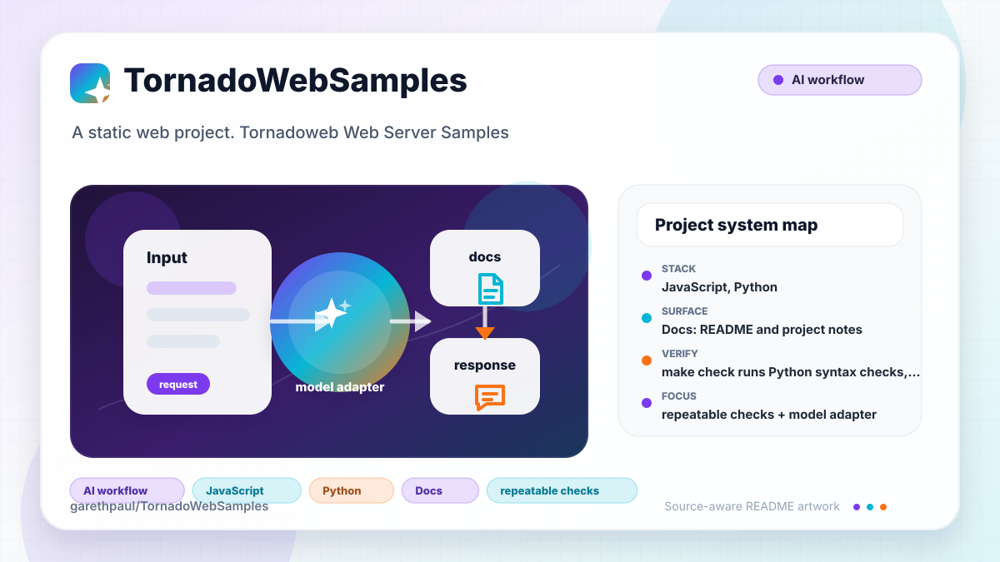

# TornadoWebSamples

<!-- README-OVERVIEW-IMAGE -->


## Overview

`garethpaul/TornadoWebSamples` is a static web project. Tornadoweb Web Server Samples

This README is based on the checked-in source, manifests, scripts, and repository metadata on the `master` branch. The project language mix found during review was: JavaScript (2), Python (2).

## Repository Contents

- `README.md` - project overview and local usage notes
- `CHANGES.md` - maintenance history for Tornado chat checks
- `comet_chat` - source or example code
- `Makefile` - local verification entry points
- `docs/plans` - completed maintenance plans for the current baseline
- `plans` - historical implementation notes
- `requirements.txt` - runtime dependency notes
- `scripts` - documentation-plan validators
- `SECURITY.md` - security reporting and disclosure guidance
- `socket_chat` - source or example code
- `test-requirements.txt` - test dependency notes
- `tests` - focused handler and static asset tests
- `VISION.md` - project direction and maintenance guardrails

Additional scan context:

- Source directories: comet_chat, socket_chat
- Dependency and build manifests: Makefile, requirements.txt, test-requirements.txt
- Entry points or build surfaces: comet_chat/application.py, socket_chat/application.py
- Test-looking files: tests/test_chat_handlers.py, tests/test_static_assets.py

## Getting Started

### Prerequisites

- Git
- Python 3.10 or newer; CI verifies Python 3.10, 3.12, and 3.14

### Setup

```bash
git clone https://github.com/garethpaul/TornadoWebSamples.git
cd TornadoWebSamples
python3 -m pip install -r requirements.txt -r test-requirements.txt
```

The setup commands above are derived from repository files. Legacy mobile, Python, or JavaScript samples may require older SDKs or package versions than a modern workstation uses by default.

## Running or Using the Project

- Run either sample with Python after installing requirements:
  `python3 comet_chat/application.py` or `python3 socket_chat/application.py`.
- Both tutorial servers bind to `127.0.0.1:8000` by default so the
  unauthenticated chat endpoint is not exposed to the local network.
- Tornado is pinned to 6.5.6. Template and static asset paths are resolved from
  each sample directory, so either command can be launched from another
  working directory.

## Testing and Verification

- `make check` runs Python syntax checks, focused chat-handler tests, a real
  in-process HTTP long-poll test, message validation tests, static asset checks,
  and a vulnerability audit of the resolved environment.
- Static asset checks also keep chat clients on same-origin message endpoints
  and require HTTPS for the shared external reset stylesheet. Template checks
  keep the browser input length hint aligned with the server-side message
  limit.
- Handler tests require WebSocket origin checks to accept only the same host and
  comet long-poll callback queues to stay isolated per message store. They also
  require abandoned comet long-poll callbacks to be removed when a connection
  closes. Comet dispatch tests require callback queues to be snapshot and
  cleared before firing so callbacks registered during dispatch wait for the
  next message. They also require one failed callback delivery not to stop later
  callbacks in the same batch. WebSocket broadcast tests require failed client
  deliveries to be logged, discarded, and isolated from later callbacks.
- `make check` also requires completed canonical plans under `docs/plans`.
- GitHub Actions installs the pinned runtime and test requirements, then runs
  the same `make check` baseline on Python 3.10, 3.12, and 3.14 for pushes,
  pull requests, and manual runs. The workflow has read-only permissions, a
  ten-minute timeout, and commit-pinned Node 24 actions.

When the required SDK or runtime is unavailable, use static checks and source review first, then verify on a machine that has the matching platform toolchain.

## Configuration and Secrets

- No required secret or credential file was identified in the repository scan. If you add integrations later, keep secrets out of git.

## Security and Privacy Notes

- Review changes touching network requests, sockets, or service endpoints; examples from the scan include comet_chat/application.py, comet_chat/templates/index.html, socket_chat/application.py, socket_chat/static/socketchat.js, and 1 more.
- Review changes touching file, media, JSON, XML, CSV, OCR, or data parsing; examples from the scan include comet_chat/application.py, comet_chat/static/cometchat.js, socket_chat/static/socketchat.js.
- Browser chat clients should use same-origin message endpoints rather than
  hard-coded localhost URLs.

## Maintenance Notes

- See `SECURITY.md` for vulnerability reporting and safe research guidance.
- See `VISION.md` for project direction and contribution guardrails.
- See `docs/plans/2026-06-08-tornado-web-samples-baseline.md` for the
  canonical Tornado chat sample baseline.
- See `docs/plans/2026-06-08-message-validation.md` for chat message input
  validation coverage.
- See `docs/plans/2026-06-09-chat-client-endpoints.md` for client endpoint and
  external asset URL coverage.
- See `docs/plans/2026-06-09-websocket-origin-check.md` for same-host
  WebSocket origin coverage.
- See `docs/plans/2026-06-09-comet-callback-isolation.md` for long-poll
  callback isolation coverage.
- See `docs/plans/2026-06-09-message-length-hint.md` for browser message
  length hint coverage.
- See `docs/plans/2026-06-09-comet-callback-close-cleanup.md` for abandoned
  long-poll callback cleanup coverage.
- See `docs/plans/2026-06-09-comet-callback-dispatch-snapshot.md` for comet
  callback dispatch ordering coverage.
- See `docs/plans/2026-06-09-comet-callback-exception-isolation.md` for comet
  callback delivery exception isolation.
- See `docs/plans/2026-06-09-websocket-callback-exception-isolation.md` for
  WebSocket callback delivery exception isolation.
- See `docs/plans/2026-06-10-ci-baseline.md` for the Tornado 6 runtime and CI
  modernization.

## Contributing

Keep changes small and tied to the project that is already present in this repository. For code changes, document the toolchain used, avoid committing generated dependency directories or local configuration, and update this README when setup or verification steps change.
